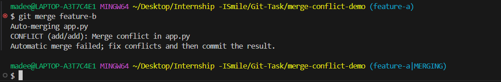
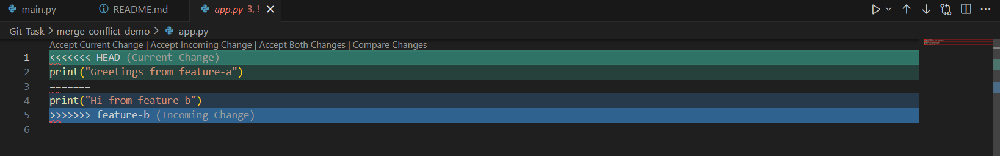
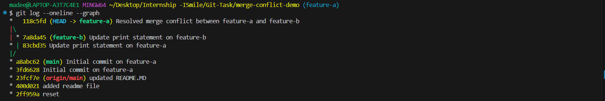

# Resolving Merge Conflicts in Git Using Two Feature Branches

This guide demonstrates how to resolve a **merge conflict** in Git between two branches (`feature-a` and `feature-b`) that are not the main branch. The conflict occurs in a Python file `app.py`.

---

##  Setup Scenario

1. **Initialize a Git repository**:

   ```bash
   mkdir merge-conflict-demo && cd merge-conflict-demo
   git init
   ```

2. **Create initial Python file**:

   ```bash
   echo "print('Hello from main branch')" > app.py
   git add app.py
   git commit -m "Initial commit with app.py"
   ```

3. **Create two branches from `main`**:

   ```bash
   git checkout -b feature-a
   git checkout main
   git checkout -b feature-b
   ```

4. **Make conflicting changes in `feature-a`**:

   ```bash
   git checkout feature-a
   echo "print('Feature A change')" > app.py
   git commit -am "Update app.py in feature-a"
   ```

5. **Make conflicting changes in `feature-b`**:

   ```bash
   git checkout feature-b
   echo "print('Feature B change')" > app.py
   git commit -am "Update app.py in feature-b"
   ```

---

##  Merge Conflict

Try merging `feature-a` into `feature-b`:

```bash
# On feature-b
git merge feature-a
```

You will see a **merge conflict** in `app.py`:
<br />

```diff
<<<<<<< HEAD
print('Feature B change')
=======
print('Feature A change')
>>>>>>> feature-a
```
<br />

---

##  Resolve Conflict

1. **Edit `app.py`** to manually resolve the conflict. For example:

   ```python
   print('Merged change from A and B')
   ```

2. **Stage the resolved file**:

   ```bash
   git add app.py
   ```

3. **Commit the merge**:

   ```bash
   git commit
   ```

---

##  Verify

Check your log:

```bash
git log --graph --oneline --all
```

You should see the branches merged.
<br />

---

git reset --mixed HEAD~1

# Uncommit and discard all changes (DANGEROUS)
git reset --hard HEAD~1
```

---
